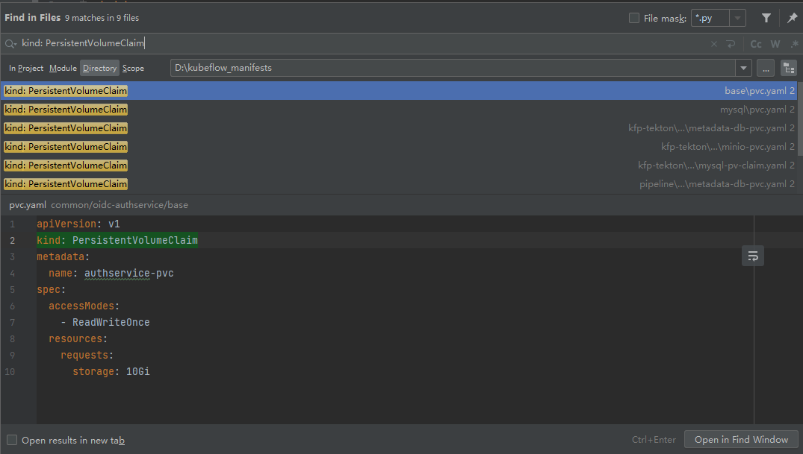
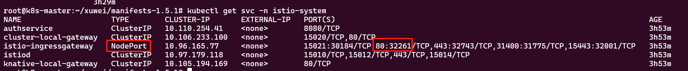
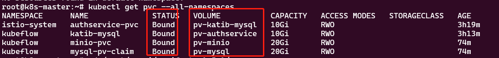
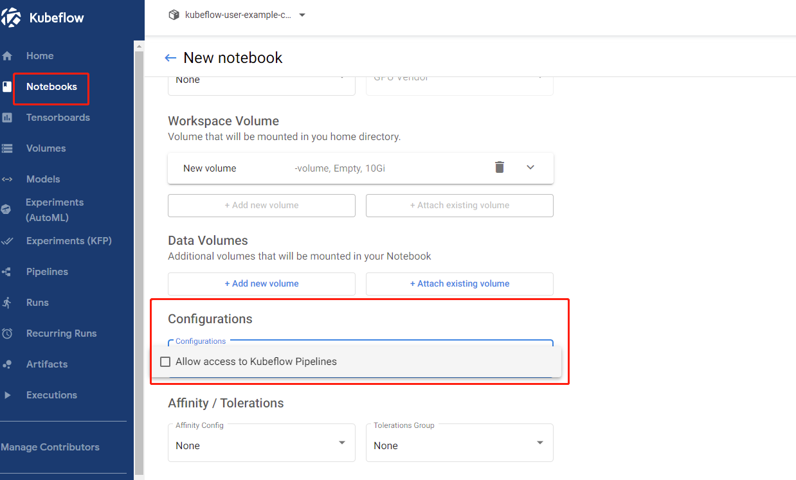

# 安装前

## 1- 配置pv

- 因为kubeflow整个项目中声明了6个pvc，如下图所示：



- 所以在正式安装前，先准备好所需要的pv，建议多准备几个，[pv.yaml见](./xuwei_yaml/pv.yaml)

## 2- 安装kustomize

```shell
cd $GOROOT/bin
sudo curl -s "https://raw.githubusercontent.com/kubernetes-sigs/kustomize/master/hack/install_kustomize.sh"  | sudo bash
```

## 3- 安装过程

- 在安装过程的每一步骤中，有可能出错，报错的话安装两遍，错误原因可能是因为上一步的还没启动。

# 开始安装

Install individual components（逐一安装）
In this section, we will install each Kubeflow official component (under apps) and each common service (under common) separately, using just kubectl and kustomize.

## 1- cert-manager:

- --validate=false 很关键
```shell
kustomize build common/cert-manager/cert-manager/base | kubectl apply --validate=false -f -
kustomize build common/cert-manager/kubeflow-issuer/base | kubectl apply -f -
```

## 2- Istio

Istio is used by many Kubeflow components to secure their traffic, enforce
network authorization and implement routing policies.

Install Istio:
报错的话安装两遍，错误原因可能是因为上一步的还没启动
```sh
kustomize build common/istio-1-11/istio-crds/base | kubectl apply -f -
kustomize build common/istio-1-11/istio-namespace/base | kubectl apply -f -
kustomize build common/istio-1-11/istio-install/base | kubectl apply -f -
```

## 3- Dex

Dex is an OpenID Connect Identity (OIDC) with multiple authentication backends. In this default installation, it includes a static user with email `user@example.com`. By default, the user's password is `12341234`. For any production Kubeflow deployment, you should change the default password by following [the relevant section](#change-default-user-password).

Install Dex:

```sh
kustomize build common/dex/overlays/istio | kubectl apply -f -
```

## 4- OIDC AuthService

The OIDC AuthService extends your Istio Ingress-Gateway capabilities, to be able to function as an OIDC client:

安装这个时，修改了原文档`common/oidc-authservice/basestatefulset.yaml`，新增了下面的信息，不然会无权限访问的错误

```yaml
spec:
  initContainers:
    - name: fix-permission
      image: busybox
      command: [ 'sh', '-c' ]
      args: [ 'chmod -R 777 /var/lib/authservice;' ]
      volumeMounts:
        - mountPath: /var/lib/authservice
          name: data
  containers:
  - name: authservice
```

```sh
kustomize build common/oidc-authservice/base | kubectl apply -f -
```

## 5- Knative

Knative is used by the KFServing official Kubeflow component.

Install Knative Serving:

```sh
kustomize build common/knative/knative-serving/overlays/gateways | kubectl apply -f -
kustomize build common/istio-1-11/cluster-local-gateway/base | kubectl apply -f -
```

Optionally, you can install Knative Eventing which can be used for inference request logging:

```sh
kustomize build common/knative/knative-eventing/base | kubectl apply -f -
```

## 6- Kubeflow Namespace

Create the namespace where the Kubeflow components will live in. This namespace
is named `kubeflow`.

Install kubeflow namespace:

```sh
kustomize build common/kubeflow-namespace/base | kubectl apply -f -
```

## 7- Kubeflow Roles

Create the Kubeflow ClusterRoles, `kubeflow-view`, `kubeflow-edit` and
`kubeflow-admin`. Kubeflow components aggregate permissions to these
ClusterRoles.

Install kubeflow roles:

```sh
kustomize build common/kubeflow-roles/base | kubectl apply -f -
```

## 8- Kubeflow Istio Resources

Create the Istio resources needed by Kubeflow. This kustomization currently
creates an Istio Gateway named `kubeflow-gateway`, in namespace `kubeflow`.
If you want to install with your own Istio, then you need this kustomization as
well.

Install istio resources:

```sh
kustomize build common/istio-1-11/kubeflow-istio-resources/base | kubectl apply -f -
```

## 9- Kubeflow Pipelines

Install the [Multi-User Kubeflow Pipelines](https://www.kubeflow.org/docs/components/pipelines/multi-user/) official Kubeflow component:

- minio-5b65df66c9-q457x 可能报错CreateContainerConfigError
```sh
kustomize build apps/pipeline/upstream/env/cert-manager/platform-agnostic-multi-user | kubectl apply -f -
```


## 10- KServe / KFServing

KFServing was rebranded to KServe.

Install the KServe component:

```sh
kustomize build contrib/kserve/kserve | kubectl apply -f -
```

Install the Models web app:

```sh
kustomize build contrib/kserve/models-web-app/overlays/kubeflow | kubectl apply -f -
```

## 11- Katib

Install the Katib official Kubeflow component:

```sh
kustomize build apps/katib/upstream/installs/katib-with-kubeflow | kubectl apply -f -
```

## 12- Central Dashboard

Install the Central Dashboard official Kubeflow component:

```sh
kustomize build apps/centraldashboard/upstream/overlays/kserve | kubectl apply -f -
```

## 13- Admission Webhook

Install the Admission Webhook for PodDefaults:

```sh
kustomize build apps/admission-webhook/upstream/overlays/cert-manager | kubectl apply -f -
```

## 14- Notebooks

Install the Notebook Controller official Kubeflow component:

```sh
kustomize build apps/jupyter/notebook-controller/upstream/overlays/kubeflow | kubectl apply -f -
```

Install the Jupyter Web App official Kubeflow component:

```sh
kustomize build apps/jupyter/jupyter-web-app/upstream/overlays/istio | kubectl apply -f -
```

## 15- Profiles + KFAM

Install the Profile Controller and the Kubeflow Access-Management (KFAM) official Kubeflow
components:

```sh
kustomize build apps/profiles/upstream/overlays/kubeflow | kubectl apply -f -
```

## 16- Volumes Web App

Install the Volumes Web App official Kubeflow component:

```sh
kustomize build apps/volumes-web-app/upstream/overlays/istio | kubectl apply -f -
```

## 17- Tensorboard

Install the Tensorboards Web App official Kubeflow component:

```sh
kustomize build apps/tensorboard/tensorboards-web-app/upstream/overlays/istio | kubectl apply -f -
```

Install the Tensorboard Controller official Kubeflow component:

```sh
kustomize build apps/tensorboard/tensorboard-controller/upstream/overlays/kubeflow | kubectl apply -f -
```

## 18- Training Operator

Install the Training Operator official Kubeflow component:

```sh
kustomize build apps/training-operator/upstream/overlays/kubeflow | kubectl apply -f -
```

## 19- User Namespace

Finally, create a new namespace for the the default user (named `kubeflow-user-example-com`).

```sh
kustomize build common/user-namespace/base | kubectl apply -f -
```

## 20- Connect to your Kubeflow Cluster

After installation, it will take some time for all Pods to become ready. Make sure all Pods are ready before trying to connect, otherwise you might get unexpected errors. To check that all Kubeflow-related Pods are ready, use the following commands:

```sh
kubectl get pods -n cert-manager
kubectl get pods -n istio-system
kubectl get pods -n auth
kubectl get pods -n knative-eventing
kubectl get pods -n knative-serving
kubectl get pods -n kubeflow
kubectl get pods -n kubeflow-user-example-com
```

成功后，通过 `kubectl get svc -n istio-system` 查看可以看到暴露的端口


浏览器输入服务器的`ip:32261`即可看到登录页面，默认登录账号密码 `user@example.com`  /  `12341234`

# 安装结束后 Pending 、 CrashLoopBackOff、Error

- 安装结束后，在20步骤的时候可能会看到许多pod的状态不是 running，需要定位修复

## Pending

- 通过命令 `kubectl describe pod xxxpodname -n namespace` 或 `kubectl logs  xxxpodname -n namespace` 查看具体的错误信息。
- 有一些Pending 是因为 pvc 没有找到 pv（持久卷导致的）


- 通过新建pv，可以解决这类问题，新建pv时要保证存储和pvc的存储大小一致

[参见pv.yaml](xuwei_yaml/pv.yaml)

然后执行命令 `kubectl apply -f pv.yaml` 创建持久卷，创建好后pvc会自动绑定，然后在 `kubectl get pod --all-namespaces` 查看pod的状态，
Pending都消除了，没消除的执行 `kubectl delete pod xxxpodname -n namespace` 删除pod，会自动重建。

## CrashLoopBackOff、Error 问题解决待续


## 创建jupyter的时候返回 Could not find CSRF cookie XSRF-TOKEN 错误

主要是由于jupyter-web-app的安全验证策略导致的，详细见https://github.com/kubeflow/kubeflow/issues/5803 
解决方案环境变量加上APP_SECURE_COOKIES=false,修改见下：

即在[params.env](./apps/jupyter/jupyter-web-app/upstream/base/params.env)和
[deployment.yaml](./apps/jupyter/jupyter-web-app/upstream/base/deployment.yaml)中加上变量APP_SECURE_COOKIES=false，
然后重新执行命令

```shell
kustomize build apps/jupyter/jupyter-web-app/upstream/overlays/istio | kubectl apply -f -

kubectl delete pod jupyter-web-app-deployment-75b9fcb878-5kgzx -n kubeflow

# 删除后会自动重建，等重建完就好了
```

## 通过notebook 使用 kf.client 提交 pipeline

Multi-User mode
Note, multi-user mode technical details were put in the How in-cluster authentication works section below.

Choose your use-case from one of the options below:

Access Kubeflow Pipelines from Jupyter notebook

In order to access Kubeflow Pipelines from Jupyter notebook, an additional per namespace (profile) manifest is required:

- "<YOUR_USER_PROFILE_NAMESPACE>" 比如我的是 `kubeflow-user-example-com`
- [参见](./xuwei_yaml/access_pipeline_for_jupyter.yaml)
```yaml
apiVersion: kubeflow.org/v1alpha1
kind: PodDefault
metadata:
  name: access-ml-pipeline
  namespace: "<YOUR_USER_PROFILE_NAMESPACE>"
spec:
  desc: Allow access to Kubeflow Pipelines
  selector:
    matchLabels:
      access-ml-pipeline: "true"
  volumes:
    - name: volume-kf-pipeline-token
      projected:
        sources:
          - serviceAccountToken:
              path: token
              expirationSeconds: 7200
              audience: pipelines.kubeflow.org      
  volumeMounts:
    - mountPath: /var/run/secrets/kubeflow/pipelines
      name: volume-kf-pipeline-token
      readOnly: true
  env:
    - name: KF_PIPELINES_SA_TOKEN_PATH
      value: /var/run/secrets/kubeflow/pipelines/token
```


After the manifest is applied, newly created Jupyter notebook contains an additional option in the **configurations** section. 


Note, Kubeflow `kfp.Client` expects token either in `KF_PIPELINES_SA_TOKEN_PATH` environment variable or 
mounted to `/var/run/secrets/kubeflow/pipelines/token`. Do not change these values in the manifest. 
Similarly, `audience` should not be modified as well. No additional setup is required to refresh tokens.

Remember the setup has to be repeated per each namespace (profile) that should have access to Kubeflow Pipelines API from within Jupyter notebook.


## 让notebook具有root权限

- 这样可以apt-get安装一些软件

- 重构镜像
```shell
# 让容器用户具有免密root权限
docker run --name xwtest -it -e GRANT_SUDO=yes --user root -p 8888:8888 -d public.ecr.aws/j1r0q0g6/notebooks/notebook-servers/jupyter-scipy:v1.5.0
# 打包该镜像
docker commit 8e48346f8567 public.ecr.aws/j1r0q0g6/notebooks/notebook-servers/jupyter-scipy-root:v1.5.0
# 查看
docker ps|grep jupyter-scipy-root
```