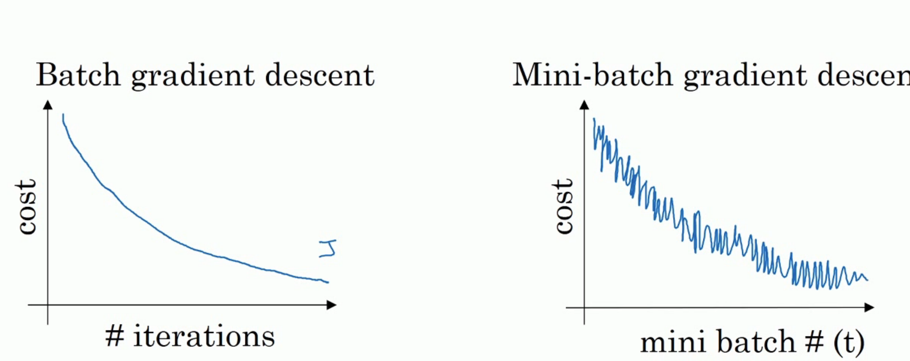
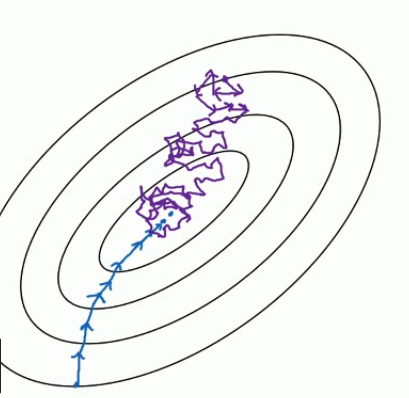

# 深度学习中的full batch、mini batch、batch、batch size、iterations与epoch

## full batch

- 梯度下降使用了全部的样本数据，叫做full batch。

在梯度下降中需要对所有样本进行处理过后然后走一步，那么如果我们的样本规模的特别大的话效率就会比较低。
假如有500万，甚至5000万个样本(在我们的业务场景中，一般有几千万行，有些大数据有10亿行)的话走一轮迭代就会非常耗时。
这个时候的梯度下降使用了全部的样本数据，所以叫做full batch。

## mini batch

为了提高效率，我们可以把样本分成等量的子集。 例如我们把500万样本分成1000份（子集）， 每份5000个样本， 每一个子集都是mini batch。

## batch size

每一个子集中的样本个数就称为 `batch size`，上面的例子中，每份5000个样本，这里的`5000`就是`batch size`。

## iterations

我们分别用一个for循环遍历这1000个子集。 针对每一个子集（mini batch）做一次梯度下降。 然后更新参数`w`和`b`的值。
接着到下一个子集中继续进行梯度下降。 这样在遍历完所有的mini batch之后我们相当于在梯度下降中做了1000次迭代（iterations）。 

## epoch
我们将遍历一次所有样本的行为叫做一个 `epoch`，也就是一个世代。 上面的1000次迭代就是一个 `epoch`。

## 超参数汇总

在mini batch下的梯度下降中做的事情其实跟full batch一样，只不过我们训练的数据不再是所有的样本，而是一个个的子集。 
这样在mini batch我们在一个epoch中就能进行1000次的梯度下降，而在full batch中只有一次。 这样就大大的提高了我们算法的运行速度（以及梯度下降的迭代次数）。

- batch 是批，有`full batch` 和 `mini batch` 两种。深度学习每一次参数的更新所需要损失函数并不是由一个{data：label}获得的，而是由一组数据加权得到的，这一组数据的数量就是[batch size]。

- batch size 最大是样本总数N，此时就是Full batch learning。如果数据集较小，可以采用全数据集（Full batch learning）的形式，
这样有两个显然的好处：1.由全数据集计算的梯度能够更好的代表样本总体，从而更准确的朝向极值所在的方向；2.不同权重的梯度值差别很大，因此选取一个全局的学习率会比较困难（？）
batch size最小是1，即每次只训练一个样本，这就是在线学习（Online Learning）。
batch size既不是最大N，也不是最小1，此时就是通常意义上的 batch（有的框架如keras也称之为mini batch）

- epoch：世代。当我们分批学习时，每次使用过全部训练数据（全部子集）完成一次 Forword(前向传播) 运算以及一次BP（back propagation 反向传播）运算，成为完成了一次epoch（世代）。

- Iterations：迭代。比如，我们有1000个样本，batch size是50，其将会有20个Iterations。这20个Iteration完成一个Epoch。

## batch利弊分析

batch的思想，至少有两个作用，一是更好的处理非凸的损失函数，非凸的情况下， 全样本就算工程上算的动， 也会卡在局部优上， 批表示了全样本的部分抽样实现， 相当于人为引入修正梯度上的采样噪声，使“一路不通找别路”更有可能搜索最优值；二是合理利用内存容量。

batch的优点：1、更少的内存；2,、训练速度快

batch的缺点：1、精度较低；2、迭代过程中，损失函数（loss）会上下波动（但总体是向下的）

如上图，左边是full batch的梯度下降效果。 可以看到每一次迭代成本函数都呈现下降趋势，这是好的现象，说明我们w和b的设定一直再减少误差。 
这样一直迭代下去我们就可以找到最优解。 右边是mini batch的梯度下降效果，可以看到它是上下波动的，成本函数的值有时高有时低，但总体还是呈现下降的趋势。 
这个也是正常的，因为我们每一次梯度下降都是在min batch上跑的而不是在整个数据集上。 数据的差异可能会导致这样的效果(可能某段数据效果特别好，某段数据效果不好)。
但没关系，因为他整体的是呈下降趋势的。

把上面的图看做是梯度下降空间。 下面的蓝色的部分是full batch的而上面是mini batch。 就像上面说的mini batch不是每次迭代损失函数都会减少，
所以看上去好像走了很多弯路。 不过整体还是朝着最优解迭代的。 而且由于mini batch一个epoch就走了5000步（5000次梯度下降），
而full batch一个epoch只有一步。所以虽然mini batch走了弯路但还是会快很多。

## batch size经验公式

既然有了mini batch那就会有一个batch size的超参数，也就是块大小。代表着每一个mini batch中有多少个样本。 我们一般设置为2的n次方。 
例如64,128,512,1024. 一般不会超过这个范围。不能太大，因为太大了会无限接近full batch的行为，速度会慢。 也不能太小，太小了以后可能算法永远不会收敛。 
当然如果我们的数据比较小， 但也用不着mini batch了。 full batch的效果是最好的。

## batch --> horovod 数据并行分布式训练

可见很多框架在单机训练时，已经把大数据进行了分块（batch）进行训练，从而实现较快的梯度下降。

在使用horovod进行数据并行分布式训练时，有的框架可以自动做数据分割。如果框架不提供，则需要用户自己进行数据分割，以保证每个GPU进程训练的数据集是不一样的。

