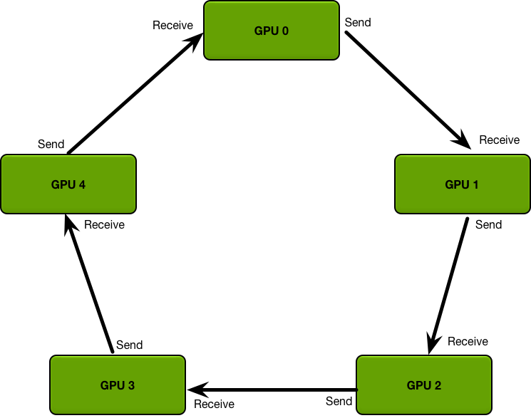

## parameter server

假如有5块GPU， 0号GPU为master，也是reducer, GPU 0将数据分成五份分到各个卡上，每张卡负责自己的那一份mini-batch的训练，得到grad后，
返回给GPU 0上做累积，得到更新的权重参数后，再分发给各个卡. 导致木桶效应严重，所有的卡都要和master通信进行数据、梯度、参数的通信，时间开销大。

有N个GPU，通信一次完整的参数所需时间为K，那么使用PS架构，花费的通信成本为: T=2(N−1)K,通信时间与GPU数量线性相关

## Allreduce

GPU高效通信算法-Ring Allreduce（这个方法被证明是一个带宽最优算法。）

该算法是百度在 《Bringing HPC techniques to deep learning 》提出， 在 ring Allreduce 中，所有的GPU形成一个环。
每个GPU有一个左邻居和一个右邻居；它只会向它的右邻居发送数据，并从它的左邻居接收数据，该算法分两步进行：第一步，scatter-reduce, 第二步：allgather。

