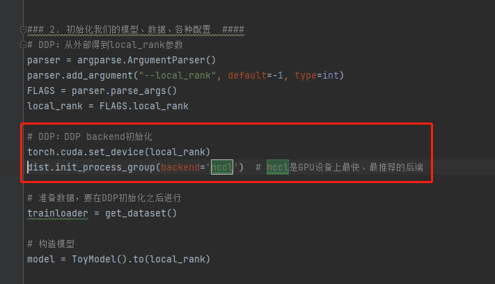
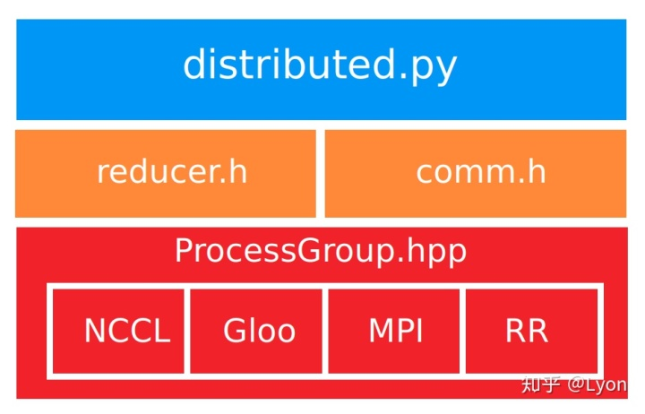

# pytorch backend 与通信方式



通信后端(backend)有 MPI、GLOO、NCCL。这 3 种 backend 支持了 3 种 通信 方式：tcp、环境变量、分布式文件系统（当前使用的 pytorch 版本如此，后续的版本就不知道了）。

所以，大致上可以认为不同 rank 之间的通信就是 由 backend 与 通信方式的 组合完成的。当然，在不同的组合方式所带来的 通信速度（影响运算整体性能）是不同的，能实现的功能也是不太一样的。

## 1- 通信集合库

集合通信库：用于分布式训练时，多个计算设备之间的集合通信，常见的有 Open MPI、NCCL、Gloo等。集合通信库（如：Open MPI、Gloo、NCCL等）都在MPI的基础上，对各种集合通信的模式和算法作了各自的实现。




- 分布式通信调度库：虽然分布式深度学习框架的通信大都采用的是以上提及的NCCL、Open MPI一类的通信库，但是因为深度学习框架设计的历史包袱以及实现质量的参差不齐，各框架原生的通信接口的效果并不稳定，也不易上手。在实际应用中，反而是第三方的Horovod成为了各框架的“标配第三方库”。Horovod 对底层通信库（MPI、NCCL、Gloo等）进行了封装，针对TensorFlow，Keras，PyTorch和Apache MXNet的分布式深度学习训练框架，提供稳定高效的通信能力。Horovod的提供的上层接口也更通用和易于用户上手，通常降低了学习门槛。

### 1.1 NCLL

NCCL是英伟达基于NCIDIA-GPU的一套开源的集体通信库，如其官网描述：NVIDIA集体通信库（NCCL）实现了针对NVIDIA GPU性能优化的多GPU和多节点集体通信原语。NCCL提供了诸如all-gather, all-reduce, broadcast, reduce, reduce-scatter等实现，这些实现优化后可以通过PCIe和NVLink等高速互联，从而实现高带宽和低延迟。 因为NCCL则是NVIDIA基于自身硬件定制的，能做到更有针对性且更方便优化，故在英伟达硬件上，NCCL的效果往往比其它的通信库更好。

### 1.2 Open MPI

Open MPI项目是一个开源MPI（消息传递接口 ）实现，由学术，研究和行业合作伙伴联盟开发和维护。因此，Open MPI可以整合高性能计算社区中所有专家，技术和资源，以构建可用的最佳MPI库。

### 1.3 GLOO

Gloo是facebook开源的一套集体通信库，他提供了对机器学习中有用的一些集合通信算法如：barrier, broadcast, allreduce

[更多知识参见](https://zhuanlan.zhihu.com/p/276122469)

## 2- Pytorch NCCL 详解
### 2.1- NCCL 与 tcp

nccl 与 gloo 使用 tcp 的方式是一致的，不需要多余的操作。在运行 python 脚本的时候，只需要将传入 backend 的参数 gloo 改为 nccl 即可。

### 2.2- NCCL 与 环境变量

nccl 使用环境变量，相对于 tcp 要复杂一些。

首先，需要将传入 backend 的参数 gloo 改为 nccl
其次，将传入 init-method 的参数 由 tcp://ip:port 改为 env://
另外，容器启动的时候的需要给容器设置 2 个环境变量 MASTER_ADDR ，MASTER_PORT
还是在 192.168.61.55 和 192.168.61.56 两台机器上操作，启动大致如下：

```shell
# 机器 1
docker run -it --rm --env-file /mnt/pytorch_env/master -v /mnt/pytorch/:/pytorch -w /pytorch --net=host loongc/pytorch:pytorch python mnist.py --rank 0 --world-size 2 --init-method env:// --backend nccl

# 机器 2
docker run -it --rm --env-file /mnt/pytorch_env/master -v /mnt/pytorch/:/pytorch -w /pytorch --net=host loongc/pytorch:pytorch python mnist.py --rank 1 --world-size 2 --init-method env:// --backend nccl

# 文件 /mnt/pytorch_env/master 内容如下
MASTER_ADDR=192.168.61.55
MASTER_PORT=9090
```

上述 /mnt/pytorch_env/master 文件的内容中 MASTER_ADDR=192.168.61.55 是 rank0 所在机器的 ip ，MASTER_PORT=9090 是该机器上一个未被征用的 端口


### 2.3- NCCL 与 分布式文件系统
nccl 使用分布式文件系统，那么就需要把分布式文件系统 映射进 容器当中，在这里，我是在 挂载目录下 /mnt/pytorch/ 创建了一个文件 backendnccl ，因为本身这个挂载 就是分布式文件系统。

```shell
# 以机器 1 上的操作为例
docker run -it --rm -v /mnt/pytorch/:/pytorch -w /pytorch --net=host loongc/pytorch:pytorch python mnist.py --rank 0 --world-size 2 --init-method file:///pytorch/backendnccl --backend nccl
```


### 2.4- 使用InfiniBand
原本，pytorch 是支持 IP over IB 的，所以可操作 InfiniBand 的方式主要有以下几种：

在使用 tcp方式 进行通信 时，可以不使用 IP 地址，而直接使用 IB (InfiniBand) 卡的地址
在使用环境变量过程中，设置的环境变量中 将 MASTER_ADDR 设置成 IB 卡的地址
另外，NCCL和Gloo后端都会尝试找到要使用的正确网络接口，如果自动检测到的接口不正确，您可以使用以下环境变量覆盖它（适用于相应的后端）：

在使用 过程中，如果确定 使用 nccl，并且打算用 InfiniBand ，推荐通过环境变量（写进 前文提到的 文件 /mnt/pytorch_env/master ） NCCL_SOCKET_IFNAME=ib0

额外说明，如果你的机器上有多张 InfiniBand 卡，你可以通过 NCCL_SOCKET_IFNAME 指定任意一张，如 ib0 或者 ib1 这种

但是，你可以直接使用 NCCL_SOCKET_IFNAME=ib 进行指定，这样所有的 ib 卡都有机会被调用起来用于通信。你可以通过相关工具，如 ibdump 进行监控 ib 卡的发包 和 数据的发送与接受。

经过分析，我们认为在 以发送数据包 的方式进行通信的过程中，除了真正用于计算的数据包，还可能包括 机器通信 的数据。

### 2.5- k8s分布式训练
自动化进行分布式训练 可以通过 k8s 启动多个 容器，进行集群管理，完成分布式训练。通过 设计 api 指定启动 指定数目的 rank，指定硬件资源，以及是否使用 InfiniBand 。

