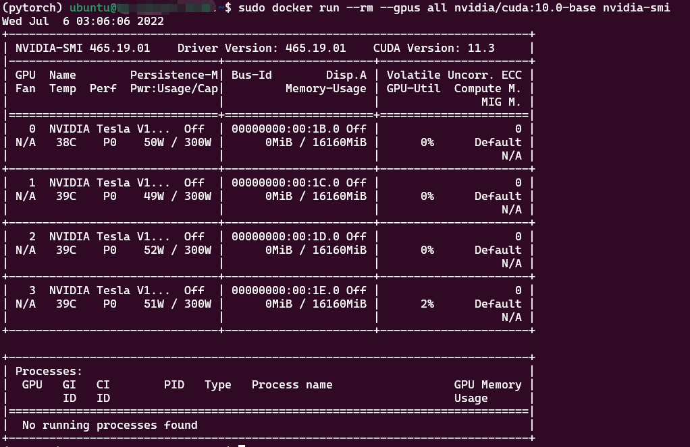

# 让docker能够使用GPU

- 为了在docker中支持GPU，NVidia之前是弄了个nvidia-docker2，现在升级为NVIDIA Container Toolkit了。官方说法是"Usage of nvidia-docker2 packages are deprecated since NVIDIA GPUs are now natively supported as devices in the Docker runtime"。
- 请通过 docker -v 检查 Docker 版本。对于 19.03 之前的版本，您需要使用 nvidia-docker2 和 --runtime=nvidia 标记；
- 对于 19.03 及之后的版本，您将需要使用 nvidia-container-toolkit 软件包和 --gpus all 标记。这两个选项都记录在上面链接的网页上。
- 若 docker 版本 > 19.03 则不需要安装 nvidia-docker ，只需要安装 nvidia-container-tookit。

## 1、docker 19.03 版本之前

[安装 nvidia-docker2](https://docs.nvidia.com/datacenter/cloud-native/container-toolkit/install-guide.html#installing-on-ubuntu-and-debian)

## 2、docker 版本 > 19.03

- 安装 nvidia-container-tookit
- 1- 添加apt-get源
```shell
distribution=$(. /etc/os-release;echo $ID$VERSION_ID) \
   && curl -s -L https://nvidia.github.io/nvidia-docker/gpgkey | sudo apt-key add - \
   && curl -s -L https://nvidia.github.io/nvidia-docker/$distribution/nvidia-docker.list | sudo tee /etc/apt/sources.list.d/nvidia-docker.list
```

- 2- 安装 并 重启docker
```shell
sudo apt-get update
sudo apt-get install -y nvidia-container-toolkit
sudo systemctl restart docker
```

- 3- 验证安装是否成功
```shell
sudo docker run --rm --gpus all nvidia/cuda:11.0.3-base-ubuntu18.04 nvidia-smi
```
成功见下图


- 4- 使用GPU方法
```shell
# 在官方CUDA镜像上测试 nvidia-smi
$ sudo docker run --gpus all nvidia/cuda:9.0-base nvidia-smi

# 启动支持双GPU的容器
$ sudo docker run --gpus 2 nvidia/cuda:9.0-base nvidia-smi

# 指定GPU 1，运行容器
$ sudo docker run --gpus device=0 nvidia/cuda:9.0-base nvidia-smi
```

### TODO 验证 使用k8是，貌似还是得安装 nvidia-docker2

[参考](https://github.com/NVIDIA/k8s-device-plugin#running)

- 修改配置
edit the config file which is usually present at /etc/docker/daemon.json to set up nvidia-container-runtime as the default low-level runtime:

```json
{
    "default-runtime": "nvidia",
    "runtimes": {
        "nvidia": {
            "path": "/usr/bin/nvidia-container-runtime",
            "runtimeArgs": []
        }
    }
}
```