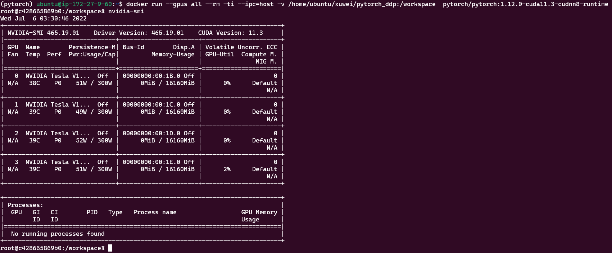

# 前提

docker 已经可以使用GPU

[docker配置GPU](./GPU_docker_load.md)

## 1- 拉取 pytorch-cuda 镜像

- 从 Docker Hub 拉取预先构建的 docker 映像并使用 docker v19.03+ 运行
- 注意：这里面pytorch版本和cuda版本一定要对应上，版本兼容问题是个大问题，不然有可能出现各种未知bug。

[镜像链接](https://hub.docker.com/r/pytorch/pytorch/tags)

```shell
docker pull pytorch/pytorch:1.12.0-cuda11.3-cudnn8-runtime
```

- 注：`pytorch/pytorch:1.12.0-cuda11.3-cudnn8-runtime`该镜像已经封装了conda、pip、`nvidia-smi`等环境，如下图所示：



## 2- 容器执行分布式训练

- 一个 pytorch 分布式训练脚本 [ddp_case1.py](./ddp_case1.py)，运行下面的命令启动：

```shell
# /home/ubuntu/xuwei/test_py 是本机存放 ddp_case1.py 的目录，挂载到容器的 workspace 目录中
# PyTorch使用共享内存在进程之间共享数据，因此如果使用torch多处理（例如，对于多线程数据加载程序），容器运行的默认共享内存段大小是不够的，您应该使用--ipc=host或--shm-size命令行选项来增加共享内存大小以运行 docker。
docker run --gpus all --rm -ti --ipc=host -v /home/autel/xuwei/test_py:/workspace  pytorch/pytorch:1.12.0-cuda11.3-cudnn8-runtime

# 执行分布式训练命令，在启动容器中执行单机多卡分布式训练
# DDP: 使用torch.distributed.launch启动DDP模式; 使用CUDA_VISIBLE_DEVICES，来决定使用哪些GPU
CUDA_VISIBLE_DEVICES="0,1,2,3" python -m torch.distributed.launch --nproc_per_node 4 ddp_case1.py
```


## 3- 本机查看GPU使用情况
- 同时你可以在`本机`（不是容器）执行下面的命令，查看GPU使用情况：

```shell
# 周期性的输出显卡的使用情况，可以用watch指令实现，每隔10秒刷新一次使用情况：
watch -n 10 nvidia-smi
```


在上面的虚线框里显示了占用GPU的进程信息。每个进程有一个唯一的PID，如果想关闭掉某个进程，可以使用命令sudo kill -9 PID。
比如我这里要结束掉占用GPU内存最大的PID为12713的进程，则执行命令sudo kill -9 12713，然后再查看GPU使用情况。


## 4- 多节点分布式训练

假设一共有两台机器（节点1和节点2），每个节点上有8张卡，节点1的IP地址为192.168.1.1 占用的端口12355（端口可以更换），启动的方式如下：

```shell
#节点1
python -m torch.distributed.launch --nproc_per_node=8
           --nnodes=2 --node_rank=0 --master_addr="192.168.1.1"
           --master_port=12355 MNIST.py
#节点2
python -m torch.distributed.launch --nproc_per_node=8
           --nnodes=2 --node_rank=1 --master_addr="192.168.1.1"
           --master_port=12355 MNIST.py
```

上例子中，如果只要启动一台机器，只需要将nnodes数量改为1，就是单机多卡的另一种方式。设置如下：

```shell
#节点1
python -m torch.distributed.launch --nproc_per_node=8
           --nnodes=1 --node_rank=0 --master_addr="192.168.1.1"
           --master_port=12355 MNIST.py
```