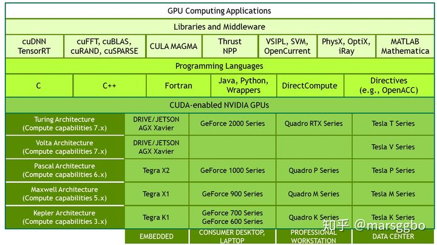
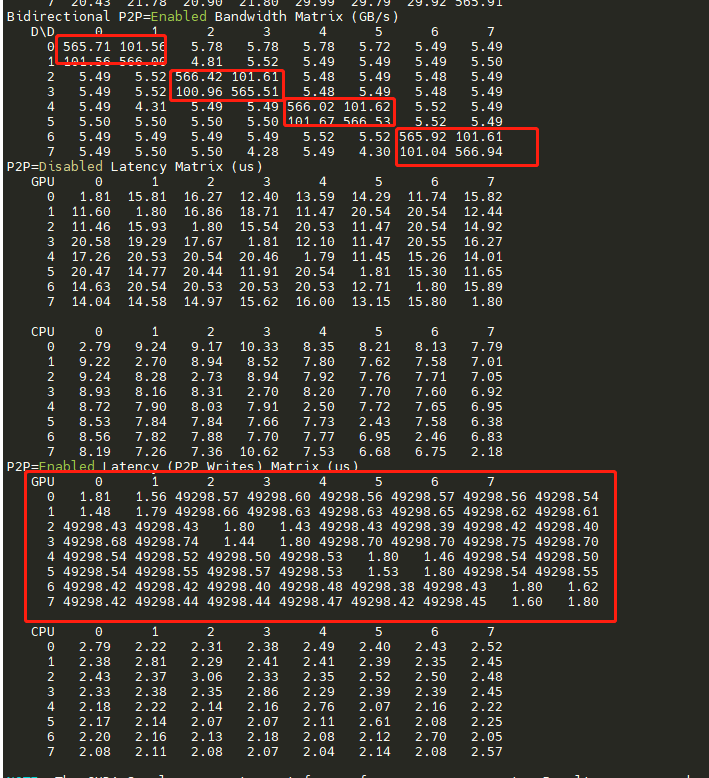

# NVIDIA A40 安装CUDA11.2+CUDNN8.1.1

## 1- 本文参考

[ubuntu 16.04 安装 cuda11.2 和cudnn8.2.1](https://blog.csdn.net/mtl1994/article/details/119039567)

[NVIDIA A40 安装CUDA11.2+CUDNN8.1.1](https://zhuanlan.zhihu.com/p/452075116)

[CUDA 和 CUDNN 安装教程参见](https://zhuanlan.zhihu.com/p/72298520)

[CUDNN 安装包下载 需要先注册账号](https://developer.nvidia.com/rdp/cudnn-download)

[CUDNN 官方安装教程](https://docs.nvidia.com/deeplearning/cudnn/install-guide/index.html)

[NCCL 安装教程](https://docs.nvidia.com/deeplearning/nccl/install-guide/index.html)

[NCCL 安装教程2](https://github.com/NVIDIA/nccl)


### 1.1- cuda 和 cudnn



CUDA (ComputeUnified Device Architecture) 是一种由 NVIDIA 推出的通用并行计算架构，只能应用于 NVIDIA 的系列显卡，
目前主流的深度学习框架包括 TensorFlow 都是使用 CUDA 来进行 GPU 加速的（可以把 CUDA 当做是一种驱动程序，
TensorFlow 通过这个驱动程序来使用显卡），所以我们必须先安装 CUDA。
CUDA是一个并行计算平台和编程模型，能够使得使用GPU进行通用计算变得简单和优雅。

深度神经网络库 (cuDNN) 是经 GPU 加速的深度神经网络基元库。
cuDNN 可大幅优化标准例程（例如用于前向传播和反向传播的卷积层、池化层、归一化层和激活层）的实施。
它强调性能、易用性和低内存开销。NVIDIA cuDNN可以集成到更高级别的机器学习框架中，实现高性能 GPU 加速。
借助 cuDNN，研究人员和开发者可以专注于训练神经网络及开发软件应用，而不必花时间进行低层级的 GPU 性能调整。
cuDNN 可加速广泛应用的深度学习框架，包括 Caffe2、Chainer、Keras、MATLAB、MxNet、PyTorch 和 TensorFlow。

### 1.3- 版本兼容(重视)

- `特别注意`：安装前要考虑好使用的pytorch、TensorFlow等版本，要保证cuda和cudnn和他们版本是兼容的。

- 本教程安装的版本是：`pytorch:1.12.0`、`cuda11.3`、`cudnn8`。

[tensorflow 与 CUDA 版本对应关系](https://www.tensorflow.org/install/source#tested_build_configurations)

[在 PyTorch 主页 可以下载与 cuda 对应的版本](https://pytorch.org/get-started/locally/)

[pytorch 与 CUDA 历史版本](https://pytorch.org/get-started/previous-versions/)

[pytorch docker 与 CUDA](https://github.com/pytorch/pytorch#using-pre-built-images)

[pytorch CUDA 版本对应的 docker 镜像](https://hub.docker.com/r/pytorch/pytorch/tags)，会发现镜像有runtime 和 devel两种tag，下文会做介绍。


## 2- 下载链接

[驱动 GPU driver 下载](https://www.nvidia.com/download/index.aspx)
[cuda下载](https://developer.nvidia.com/cuda-toolkit-archive)
[cudnn下载](https://developer.nvidia.com/rdp/cudnn-archive)
[nccl下载](https://developer.nvidia.com/nccl/nccl-download)
[nccl 对应支持的cuda版本 下载](https://docs.nvidia.com/deeplearning/nccl/release-notes/rel_2-11-4.html#rel_2-11-4)

## 3- 安装

首先使用 `nvidia-smi` 命令，测试是否已经安装好驱动，如果没该命令，则按如下步骤安装。

### 3.1- 本机(物理机)要求

- 物理机要有显卡(GPU)，查看显卡信息：

```shell
lspci | grep -i vga
```

- 使用nvidia GPU可以（一般都是nvidia的）：

```shell
lspci | grep -i nvidia
```

### 3.2- 安装 GPU driver

- 1、添加 nvidia repository

```shell
sudo add-apt-repository ppa:graphics-drivers/ppa
sudo apt update
```

- 2、安装下载好的驱动文件

根据GPU型号版本，下载对应的驱动 [驱动 GPU driver 下载](https://www.nvidia.com/download/index.aspx)

```shell
sudo dpkg -i nvidia-driver-local-repo-ubuntu1804-470.129.06_1.0-1_amd64.deb
sudo apt update
```

- 3、显示可用的驱动版本，按推荐的版本安装，推荐的应该就是第二步骤的版本，如下：

```shell
sudo ubuntu-drivers devices
```


- 4、安装驱动

```shell
# 型号斟酌下，选取
sudo apt-get install nvidia-driver-xxx
```

- 5、使用以下命令检查 NVIDIA 驱动程序是否安装正确：

```shell
# Nvidia自带一个命令行工具可以查看显存的使用情况
sudo nvidia-smi
```

`至此，驱动安装完成。`

### 3.3- 安装cuda

[cuda下载](https://developer.nvidia.com/cuda-toolkit-archive)

```shell
# 安装时把驱动去掉，上面安过驱动了，不需要再安装了
sudo sh cuda_11.2.2_460.32.03_linux.run
```

- 安装完配置环境变量，sudo vim ~/.bashrc

```shell

#export LD_LIBRARY_PATH=$LD_LIBRARY_PATH:/usr/local/cuda-11.2/lib64
#export PATH=$PATH:/usr/local/cuda-11.2/bin
#export PATH=/usr/local/cuda-11.2/bin:$PATH
#export LD_LIBRARY_PATH=/usr/local/cuda-11.2/lib64:$LD_LIBRARY_PATH

export CUDA_HOME=$CUDA_HOME:/usr/local/cuda-11.4
export PATH=/usr/local/cuda-11.2/bin:/usr/local/cuda-11.2/nsight-compute-2020.3.1${PATH:+:${PATH}}
export LD_LIBRARY_PATH=/usr/local/cuda-11.2/lib64${LD_LIBRARY_PATH:+:${LD_LIBRARY_PATH}}

```

- source ~/.bashrc

- 想卸载的话，参考：To uninstall the CUDA Toolkit, run cuda-uninstaller in /usr/local/cuda-11.4/bin

### 3.4- 安装cudnn

根据系统版本[下载deb文件](https://developer.nvidia.com/rdp/cudnn-archive)

```shell
libcudnn8_8.1.1.33-1+cuda11.2_amd64.deb
libcudnn8-dev_8.1.1.33-1+cuda11.2_amd64.deb
libcudnn8-samples_8.1.1.33-1+cuda11.2_amd64.deb
```

- 安装
```shell
#依次安装
sudo dpkg -i libcudnn8_8.2.4.15-1+cuda11.4_amd64.deb
sudo dpkg -i libcudnn8-dev_8.2.4.15-1+cuda11.4_amd64.deb
sudo dpkg -i libcudnn8-samples_8.2.4.15-1+cuda11.4_amd64.deb

#官方说法：To verify that cuDNN is installed and is running properly, compile the mnistCUDNN sample located in the /usr/src/cudnn_samples_v8 directory in the debian file.
#0. Copy the cuDNN sample to a writable path.

cp -r /usr/src/cudnn_samples_v8/ $HOME
#Go to the writable path.
cd  ~/cudnn_samples_v8/mnistCUDNN

#2. Compile the mnistCUDNN sample.
#编译文件。
sudo make clean 
sudo make # 编译有可能出错，执行 sudo apt-get install libfreeimage3 libfreeimage-dev 后再次 sudo make

# 3. Run the mnistCUDNN sample.
# 运行样例程序。
sudo ./mnistCUDNN

# 如果成功运行，会显示下列信息：pass

#查看cudnn版本
cat /usr/include/cudnn_version.h | grep CUDNN_MAJOR -A 2
```

### 3.5- 安装nccl

[参考](https://www.cnblogs.com/chenzhen0530/p/13885258.html)
- NCCL (NVIDIA Colloctive Comunications Library)是英伟达的一款直接与GPU交互的库。
- NCCL（NVIDA Collective Communications Library）目的是为了实现Multi-GPU或Multi-node之间的通信；

有两种安装方式，一是具有root权限的安装，二是不具有root权限的安装配置；

#### 3.5.1- root 权限安装

1. 下载deb文件
官网下载地址：https://developer.nvidia.com/nccl/nccl-download
注意版本与你的cuda适配。

2.安装

获得.deb安装文件如：nccl-local-repo-ubuntu1804-2.8.4-cuda11.2_1.0-1_amd64.deb后

```shell
sudo dpkg -i nccl-local-repo-ubuntu1804-2.8.4-cuda11.2_1.0-1_amd64.deb  # 安装
# 如果提示缺少公共CUDA GPG秘钥
sudo apt-key add /var/nccl-repo-2.8.3-ga-cuda10.2/7fa2af80.pub

# 必不可少更新
sudo apt update
# 需指定版本，和上面的nccl一致
sudo apt install libnccl2=2.11.4-1+cuda11.4 libnccl-dev=2.11.4-1+cuda11.4
```


#### 3.5.2- 非root用户安装配置NCCL

其实多数情况下，我们都不具有root权限，那么如果root管理员也没有为我们在使用的服务器安装配置NCCL，那么就需要我们自己将NCCL配置在个人账号下；那么方法就是从源码进行编译安装；

- 通过github项目 nccl 安装

```shell
git clone https://github.com/NVIDIA/nccl.git

cd nccl

# https://arnon.dk/tag/gpu/
sudo make src.build CUDA_HOME=/usr/local/cuda-11.4 NVCC_GENCODE="-gencode=arch=compute_87,code=sm_87"
```

then

```shell
# Install tools to create debian packages
sudo apt install build-essential devscripts debhelper fakeroot
# Build NCCL deb package
make pkg.debian.build
ls build/pkg/deb/

cd build/pkg/deb/
# 两个deb文件分别执行
sudo dpkg -i *.deb
```

#### 3.5.3- 测试 NCCL 是否正常

Tests for NCCL are maintained separately at https://github.com/nvidia/nccl-tests.

```shell
$ git clone https://github.com/NVIDIA/nccl-tests.git
$ cd nccl-tests
$ make
$ ./build/all_reduce_perf -b 8 -e 256M -f 2 -g <ngpus>
# 测试指定GPU
$ CUDA_VISIBLE_DEVICES=2,3  ./build/all_reduce_perf -b 8 -e 256M -f 2 -g 2
```

## 延时过长，操作

- 解决./p2pBandwidthLatencyTest 测试时，GPU 之间通信时间延长超长的情况，导致的nccl-test不通过



```shell
sudo vim /etc/default/grub

# Make below changes in the file:

#GRUB_CMDLINE_LINUX=""                           <----- Original commented
GRUB_CMDLINE_LINUX="iommu=soft"           <------ Change
sudo update-grub
sudo reboot

# 再次尝试
```