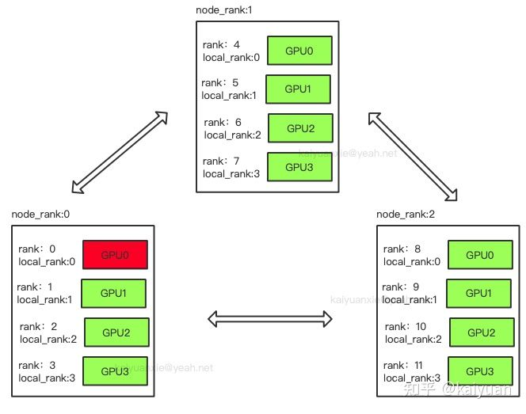

## 1 rank、local_rank、node等的概念

- rank：用于表示进程的编号/序号（在一些结构图中rank指的是软节点，rank可以看成一个计算单位），每一个进程对应了一个rank的进程，整个分布式由许多rank完成。
- node：物理节点，可以是一台机器也可以是一个容器，节点内部可以有多个GPU。
- rank与local_rank： rank是指在整个分布式任务中进程的序号；local_rank是指在一个node上进程的相对序号，local_rank在node之间相互独立。
- nnodes、node_rank与nproc_per_node： nnodes是指物理节点数量，node_rank是物理节点的序号；nproc_per_node是指每个物理节点上面进程的数量。
- word size ： 全局（一个分布式任务）中，rank的数量。

比如分布式中有三台机器，每台机器起4个进程，每个进程占用1个GPU，如下图所示：

图中：一共有12个rank，nproc_per_node=4，nnodes=3，每个节点都一个对应的node_rank。