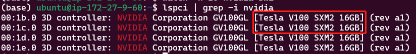

# nvidia

英伟达现在有一项非常坑爹的政策，如果在数据中心使用CUDA，那么只允许使用Tesla GPU而不能用GTX或RTX GPU。
由于担心法律问题，研究机构和大学经常被迫购买低性价比的Tesla GPU。然而，Tesla与GTX和RTX相比并没有真正的优势，价格却高出10倍。



# 总结

总的来说，本地运算首选英伟达GPU，它在深度学习上的支持度比AMD好很多；云计算首选谷歌TPU，它的性价比超过亚马逊AWS和微软Azure。
训练阶段使用TPU，原型设计和推理阶段使用本地GPU，可以帮你节约成本。如果对项目deadline或者灵活性有要求，请选择成本更高的云GPU。

```shell
CUDA_VISIBLE_DEVICES=7,8  ./build/all_reduce_perf -b 8 -e 128M -f 2 -g 2
```