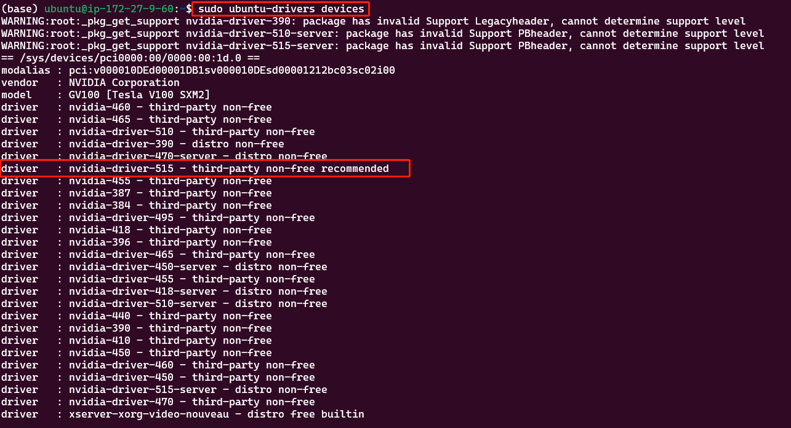

## 开始之前

[显卡，显卡驱动,nvcc, cuda driver,cudatoolkit,cudnn到底是什么](https://zhuanlan.zhihu.com/p/91334380)

## 1- 本机(物理机)要求

物理机要有显卡(GPU)

- 查看显卡信息：

```shell
lspci | grep -i vga
```

- 使用nvidia GPU可以（一般都是nvidia的）：

```shell
lspci | grep -i nvidia
```

## 2- 显卡驱动安装（nvidia GPU 驱动）

首先使用 `nvidia-smi` 命令，测试是否已经安装好驱动，如果没该命令，按如下步骤安装：

- 1、添加 nvidia repository

```shell
sudo add-apt-repository ppa:graphics-drivers/ppa
sudo apt update
```

- 2、显示可用的驱动版本，按推荐的版本安装，如下：

```shell
sudo ubuntu-drivers devices
```




- 3、安装推荐的版本驱动

```shell
# 型号斟酌下，选取
sudo apt-get install nvidia-driver-515
```

- 4、使用以下命令检查 NVIDIA 驱动程序是否安装正确：

```shell
# Nvidia自带一个命令行工具可以查看显存的使用情况
sudo nvidia-smi
```

`至此，驱动安装完成。`

## 3- 安装CUDA 和 CUDNN

### 3.1 简介


CUDA (ComputeUnified Device Architecture) 是一种由 NVIDIA 推出的通用并行计算架构，只能应用于 NVIDIA 的系列显卡，
目前主流的深度学习框架包括 TensorFlow 都是使用 CUDA 来进行 GPU 加速的（可以把 CUDA 当做是一种驱动程序，
TensorFlow 通过这个驱动程序来使用显卡），所以我们必须先安装 CUDA。
CUDA是一个并行计算平台和编程模型，能够使得使用GPU进行通用计算变得简单和优雅。


深度神经网络库 (cuDNN) 是经 GPU 加速的深度神经网络基元库。
cuDNN 可大幅优化标准例程（例如用于前向传播和反向传播的卷积层、池化层、归一化层和激活层）的实施。
它强调性能、易用性和低内存开销。NVIDIA cuDNN可以集成到更高级别的机器学习框架中，实现高性能 GPU 加速。
借助 cuDNN，研究人员和开发者可以专注于训练神经网络及开发软件应用，而不必花时间进行低层级的 GPU 性能调整。
cuDNN 可加速广泛应用的深度学习框架，包括 Caffe2、Chainer、Keras、MATLAB、MxNet、PyTorch 和 TensorFlow。

### 3.2 版本兼容

- `特别注意`：安装前要考虑好使用的pytorch、TensorFlow等版本，要保证cuda和cudnn和他们版本是兼容的。

- 本教程安装的版本是：`pytorch:1.12.0`、`cuda11.3`、`cudnn8`。

[tensorflow 与 CUDA 版本对应关系](https://www.tensorflow.org/install/source#tested_build_configurations)

[在 PyTorch 主页 可以下载与 cuda 对应的版本](https://pytorch.org/get-started/locally/)

[pytorch 与 CUDA 历史版本](https://pytorch.org/get-started/previous-versions/)

[pytorch docker 与 CUDA](https://github.com/pytorch/pytorch#using-pre-built-images)

[pytorch CUDA 版本对应的 docker 镜像](https://hub.docker.com/r/pytorch/pytorch/tags)，会发现镜像有runtime 和 devel两种tag，下文会做介绍。

### 3.3 安装CUDA 和 CUDNN
- 下面是安装教程，安装过程中如果出错，根据错误原因自行谷歌

[CUDA 和 CUDNN 安装教程参见](https://zhuanlan.zhihu.com/p/72298520)

[CUDNN 安装包下载 需要先注册账号](https://developer.nvidia.com/rdp/cudnn-download)

[CUDNN 官方安装教程](https://docs.nvidia.com/deeplearning/cudnn/install-guide/index.html)


## 4- 安装 NVIDIA NCCL 软件包

[安装教程](https://docs.nvidia.com/deeplearning/nccl/install-guide/index.html)

[安装教程2](https://github.com/NVIDIA/nccl)

# 导航

[CUDA runtime and dev 介绍](./cuda_runtime_dev_info.md)

[让docker容器可以使用GPU](./docker_use_GPU.md)

[pytorch ddp 分布式训练在docker 中使用GPU 完成](./pytorch_docker_GPU.md)