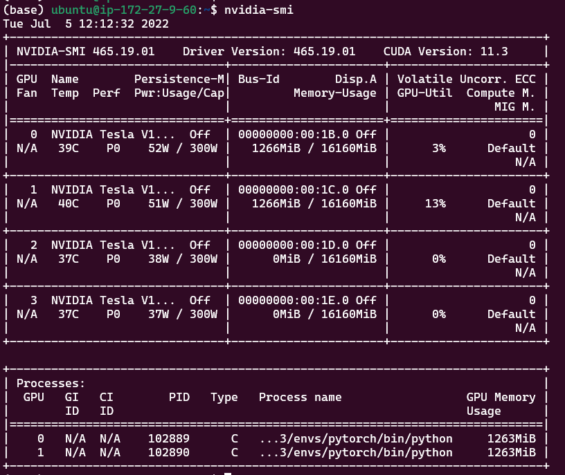

- 查看显卡信息：

```shell
lspci | grep -i vga
```


- 使用nvidia GPU可以：

```shell
lspci | grep -i nvidia
```


## nvidia-smi 命令安装 安装 cuda 和 cudnn

Nvidia自带一个命令行工具可以查看显存的使用情况：
```shell
nvidia-smi
```

在下面的虚线框里显示了占用GPU的进程信息。每个进程有一个唯一的PID，如果想关闭掉某个进程，可以使用命令sudo kill -9 PID。
比如我这里要结束掉占用GPU内存最大的PID为12713的进程，则执行命令sudo kill -9 12713，然后再查看GPU使用情况，如下图所示：




周期性的输出显卡的使用情况，可以用watch指令实现，每隔10秒刷新一次使用情况：
```shell
watch -n 10 nvidia-smi
```

[参考](https://www.ibm.com/docs/zh/visual-insights?topic=SSC5ZE/com.ibm.vi.doc/config/t_inst_nvidia_gpu_pkg.html)
sudo apt install nvidia-cuda-toolkit


