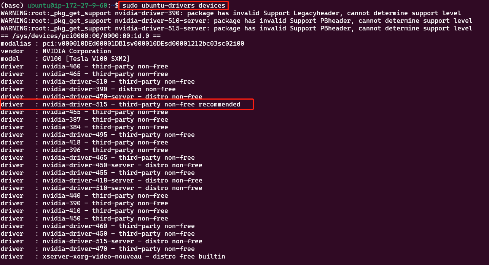
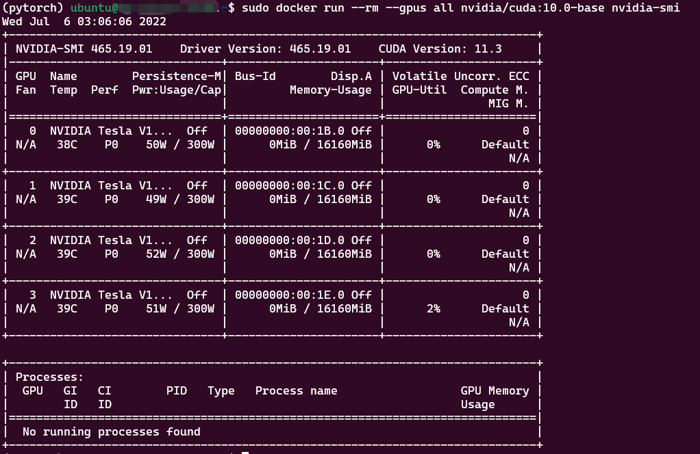
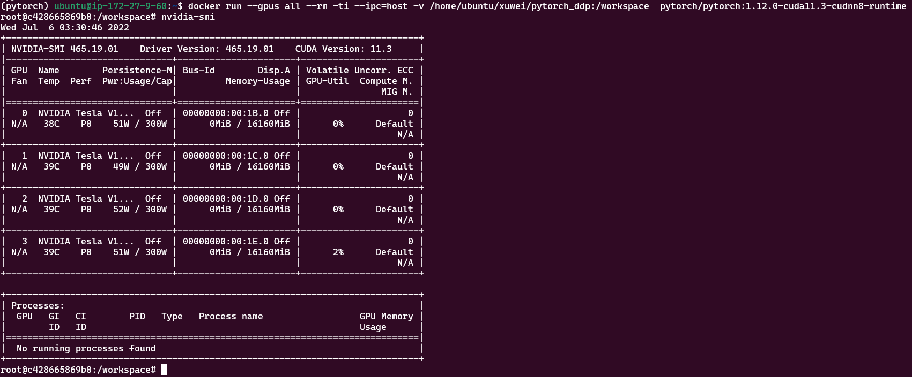
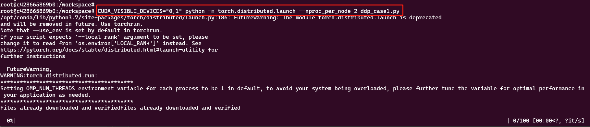
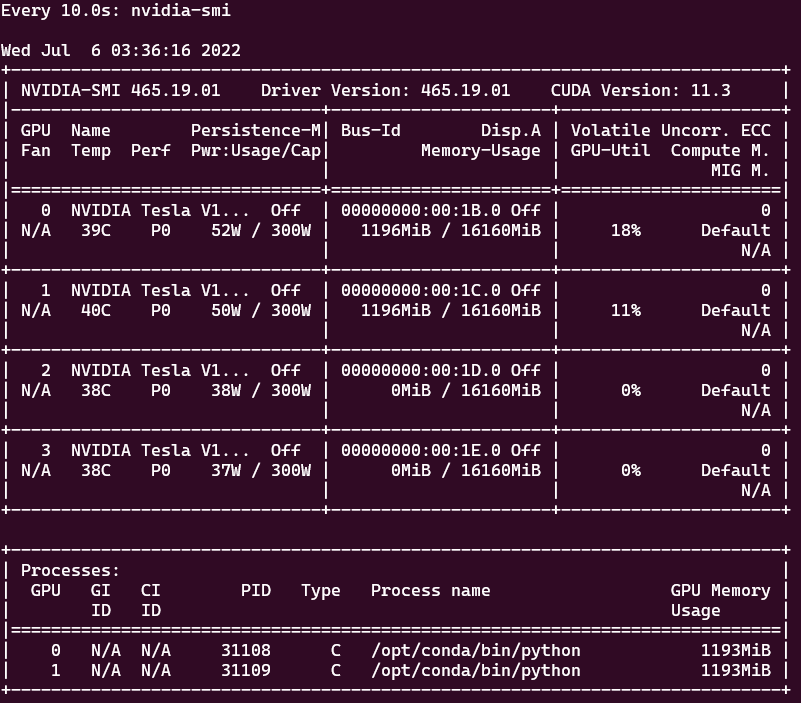

## 开始之前

[显卡，显卡驱动,nvcc, cuda driver,cudatoolkit,cudnn到底是什么](https://zhuanlan.zhihu.com/p/91334380)

## 1- 本机(物理机)要求

物理机要有显卡(GPU)

- 查看显卡信息：

```shell
lspci | grep -i vga
```

- 使用nvidia GPU可以（一般都是nvidia的）：

```shell
lspci | grep -i nvidia
```

## 2- 显卡驱动安装（nvidia GPU 驱动）

首先使用 `nvidia-smi` 命令，测试是否已经安装好驱动，如果没该命令，按如下步骤安装：

- 1、添加 nvidia repository

```shell
sudo add-apt-repository ppa:graphics-drivers/ppa
sudo apt update
```

- 2、显示可用的驱动版本，按推荐的版本安装，如下：

```shell
sudo ubuntu-drivers devices
```




- 3、安装推荐的版本驱动

```shell
# 型号斟酌下，选取
sudo apt-get install nvidia-driver-515
```

- 4、使用以下命令检查 NVIDIA 驱动程序是否安装正确：

```shell
# Nvidia自带一个命令行工具可以查看显存的使用情况
sudo nvidia-smi
```

`至此，驱动安装完成。`

## 3- 安装CUDA 和 CUDNN

### 3.1 简介
CUDA (ComputeUnified Device Architecture) 是一种由 NVIDIA 推出的通用并行计算架构，只能应用于 NVIDIA 的系列显卡，
目前主流的深度学习框架包括 TensorFlow 都是使用 CUDA 来进行 GPU 加速的（可以把 CUDA 当做是一种驱动程序，
TensorFlow 通过这个驱动程序来使用显卡），所以我们必须先安装 CUDA。


深度神经网络库 (cuDNN) 是经 GPU 加速的深度神经网络基元库。
cuDNN 可大幅优化标准例程（例如用于前向传播和反向传播的卷积层、池化层、归一化层和激活层）的实施。
它强调性能、易用性和低内存开销。NVIDIA cuDNN可以集成到更高级别的机器学习框架中，实现高性能 GPU 加速。
借助 cuDNN，研究人员和开发者可以专注于训练神经网络及开发软件应用，而不必花时间进行低层级的 GPU 性能调整。
cuDNN 可加速广泛应用的深度学习框架，包括 Caffe2、Chainer、Keras、MATLAB、MxNet、PyTorch 和 TensorFlow。

### 3.2 版本兼容

- `特别注意`：安装前要考虑好使用的pytorch、TensorFlow等版本，要保证cuda和cudnn和他们版本是兼容的。

- 本教程安装的版本是：`pytorch:1.12.0`、`cuda11.3`、`cudnn8`。

[tensorflow 与 CUDA 版本对应关系](https://www.tensorflow.org/install/source#tested_build_configurations)

[在 PyTorch 主页 可以下载与 cuda 对应的版本](https://pytorch.org/get-started/locally/)

[pytorch 与 CUDA 历史版本](https://pytorch.org/get-started/previous-versions/)

[pytorch docker 与 CUDA](https://github.com/pytorch/pytorch#using-pre-built-images)

[pytorch CUDA 版本对应的 docker 镜像](https://hub.docker.com/r/pytorch/pytorch/tags)，会发现镜像有runtime 和 devel两种tag，下文会做介绍。

### 3.3 安装CUDA 和 CUDNN
- 下面是安装教程，安装过程中如果出错，根据错误原因自行谷歌

[CUDA 和 CUDNN 安装教程参见](https://zhuanlan.zhihu.com/p/72298520)

[CUDNN 安装包下载 需要先注册账号](https://developer.nvidia.com/rdp/cudnn-download)

[CUDNN 官方安装教程](https://docs.nvidia.com/deeplearning/cudnn/install-guide/index.html)


## 4- 安装 NVIDIA NCCL 软件包

```shell
git clone https://github.com/NVIDIA/nccl.git
cd nccl
sudo make install -j4
```


## 5- docker-cuda runtime 和 devel 区别

- CUDA：为“GPU通用计算”构建的运算平台。
- cudnn：为深度学习计算设计的软件库。
- CUDA Toolkit (nvidia)： CUDA完整的工具安装包，其中提供了 Nvidia 驱动程序、开发 CUDA 程序相关的开发工具包等可供安装的选项。包括 CUDA 程序的编译器、IDE、调试器等，CUDA 程序所对应的各式库文件以及它们的头文件。
- CUDA Toolkit (Pytorch)： CUDA不完整的工具安装包，其主要包含在使用 CUDA 相关的功能时所依赖的动态链接库。不会安装驱动程序。
- （NVCC 是CUDA的编译器，只是 CUDA Toolkit 中的一部分）
- 注：CUDA Toolkit 完整和不完整的区别：在安装了CUDA Toolkit (Pytorch)后，只要系统上存在与当前的 cudatoolkit 所兼容的 Nvidia 驱动，则已经编译好的 CUDA 相关的程序就可以直接运行，不需要重新进行编译过程。如需要为 Pytorch 框架添加 CUDA 相关的拓展时（Custom C++ and CUDA Extensions），需要对编写的 CUDA 相关的程序进行编译等操作，则需安装完整的 Nvidia 官方提供的 CUDA Toolkit。

- runtime的包，没有cuda的编译工具nvcc
- devel的包，是有cuda的nvcc包的

[Pytorch 使用不同版本的 cuda](https://www.cnblogs.com/yhjoker/p/10972795.html)

对于 Pytorch 之类的深度学习框架而言，其在大多数需要使用 GPU 的情况中只需要使用 CUDA 的动态链接库支持程序的运行( Pytorch 本身
与 CUDA 相关的部分是提前编译好的 )，就像常见的可执行程序一样，不需要重新进行编译过程，只需要其所依赖的动态链接库存在即可正常运行。故而，
Anaconda 在安装 Pytorch 等会使用到 CUDA 的框架时，会自动为用户安装 cudatoolkit，其主要包含应用程序在使用 CUDA 相关的功能时所依赖的动态链接库。
在安装了 cudatoolkit 后，只要系统上存在与当前的 cudatoolkit 所兼容的 Nvidia 驱动，则已经编译好的 CUDA 相关的程序就可以直接运行，而不需要安装完整的 Nvidia 官方提供的 CUDA Toolkit .
但对于一些特殊需求，如需要为 Pytorch 框架添加 CUDA 相关的拓展时( Custom C++ and CUDA Extensions )，需要对编写的 CUDA 相关的程序进行编译等操作，则需安装完整的 Nvidia 官方提供的 CUDA Toolkit.

- 所以，如果 Pytorch 框架添加 CUDA 相关的拓展时，要使用的docker镜像tag是devel版本，不需要时用runtime就可以（这个体积小很多）。


## 6- docker pytorch 容器使用 GPU 进行训练

### 6.1 docker能够使用GPU

若 docker 版本 > 19.03 则不需要安装 nvidia-docker ，只需要安装 nvidia-container-tookit，步骤如下：

- 添加apt-get源
```shell
distribution=$(. /etc/os-release;echo $ID$VERSION_ID) \
   && curl -s -L https://nvidia.github.io/nvidia-docker/gpgkey | sudo apt-key add - \
   && curl -s -L https://nvidia.github.io/nvidia-docker/$distribution/nvidia-docker.list | sudo tee /etc/apt/sources.list.d/nvidia-docker.list
```

- 安装`nvidia-container-toolkit`
```shell
sudo apt-get update
sudo apt-get install -y nvidia-container-toolkit
sudo systemctl restart docker
```

- 验证安装是否成功
```shell
sudo docker run --rm --gpus all nvidia/cuda:10.0-base nvidia-smi
```
成功见下图


### 6.2 拉取 pytorch-cuda 镜像

您还可以从 Docker Hub 拉取预先构建的 docker 映像并使用 docker v19.03+ 运行

- 注意：这里面pytorch版本和cuda版本一定要对应上，版本兼容问题是个大问题。

```shell
docker pull pytorch/pytorch:1.12.0-cuda11.3-cudnn8-runtime
```

- 上面的镜像启动的容器是可以在容器中使用GPU的

- 注：`pytorch/pytorch:1.12.0-cuda11.3-cudnn8-runtime`该镜像已经封装了conda、pip、`nvidia-smi`等环境，如下图所示：



### 6.3 进入容器，执行脚本进行单机多卡分布式训练

一个 pytorch 分布式训练脚本 [ddp_case1.py](./ddp_case1.py)

- `/home/ubuntu/xuwei/pytorch_ddp` 是本机存放 `ddp_case1.py` 的目录，挂载到容器的`workspace`目录中，运行下面的命令启动容器：

```shell
docker run --gpus all --rm -ti --ipc=host -v /home/ubuntu/xuwei/pytorch_ddp:/workspace  pytorch/pytorch:1.12.0-cuda11.3-cudnn8-runtime
```
PyTorch使用共享内存在进程之间共享数据，因此如果使用torch多处理（例如，对于多线程数据加载程序），容器运行的默认共享内存段大小是不够的， 
您应该使用--ipc=host或--shm-size命令行选项来增加共享内存大小以运行nvidia-docker。


- 执行分布式训练命令，启动容器中的单机多卡分布式训练

```shell
# DDP: 使用torch.distributed.launch启动DDP模式
# 使用CUDA_VISIBLE_DEVICES，来决定使用哪些GPU

CUDA_VISIBLE_DEVICES="0,1" python -m torch.distributed.launch --nproc_per_node 2 ddp_case1.py
```



- 同时你可以在`本机`（不是容器）执行下面的命令，查看GPU使用情况：

```shell
# 周期性的输出显卡的使用情况，可以用watch指令实现，每隔10秒刷新一次使用情况：

watch -n 10 nvidia-smi
```



在上面的虚线框里显示了占用GPU的进程信息。每个进程有一个唯一的PID，如果想关闭掉某个进程，可以使用命令sudo kill -9 PID。
比如我这里要结束掉占用GPU内存最大的PID为12713的进程，则执行命令sudo kill -9 12713，然后再查看GPU使用情况。
