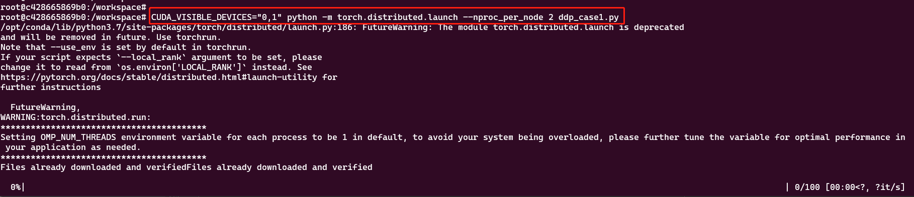

## 1- 本机(物理机)要求

物理机要有显卡(GPU)

- 查看显卡信息：

```shell
lspci | grep -i vga
```


- 使用nvidia GPU可以：

```shell
lspci | grep -i nvidia
```

## 2- 本机显卡驱动安装（nvidia GPU 驱动）

首先使用 `nvidia-smi` 命令，测试是否已经安装好驱动，如果没该命令，按如下步骤安装：


安装 安装 cuda 和 cudnn

Nvidia自带一个命令行工具可以查看显存的使用情况：
```shell
nvidia-smi
```


## docker 容器使用 GPU

若 docker 版本 > 19.03 则不需要安装 nvidia-docker ，只需要安装 nvidia-container-tookit，步骤如下：

- 添加apt-get源
```shell
distribution=$(. /etc/os-release;echo $ID$VERSION_ID) \
   && curl -s -L https://nvidia.github.io/nvidia-docker/gpgkey | sudo apt-key add - \
   && curl -s -L https://nvidia.github.io/nvidia-docker/$distribution/nvidia-docker.list | sudo tee /etc/apt/sources.list.d/nvidia-docker.list
```

- 安装`nvidia-container-toolkit`
```shell
sudo apt-get update
sudo apt-get install -y nvidia-container-toolkit
sudo systemctl restart docker
```

- 验证安装是否成功
```shell
sudo docker run --rm --gpus all nvidia/cuda:10.0-base nvidia-smi
```
成功见下图


## docker pytorch (cuda-11.3)单机多卡容器启动训练

您还可以从 Docker Hub 拉取预先构建的 docker 映像并使用 docker v19.03+ 运行

- 注意：这里面pytorch版本和cuda版本一定要对应上，版本兼容问题是个大问题。

```shell
docker pull pytorch/pytorch:1.12.0-cuda11.3-cudnn8-runtime
```

- 上面的镜像启动的容器是可以在容器中使用GPU的


### docker容器执行脚本进行单机多卡分布式训练

一个 pytorch 分布式训练脚本 [ddp_case1.py](./ddp_case1.py)

- `/home/ubuntu/xuwei/pytorch_ddp` 是本机存放 `ddp_case1.py` 的目录，挂载到容器的`workspace`目录中，运行下面的命令启动容器：

```shell
# PyTorch使用共享内存在进程之间共享数据，因此如果使用torch多处理（例如，对于多线程数据加载程序），容器运行的默认共享内存段大小是不够的，
# 您应该使用--ipc=host或--shm-size命令行选项来增加共享内存大小以运行nvidia-docker。
docker run --gpus all --rm -ti --ipc=host -v /home/ubuntu/xuwei/pytorch_ddp:/workspace  pytorch/pytorch:1.12.0-cuda11.3-cudnn8-runtime
```

- 注：`pytorch/pytorch:1.12.0-cuda11.3-cudnn8-runtime`该镜像已经封装了conda、pip、`nvidia-smi`等环境，如下图所示：


- 执行分布式训练命令，启动容器中的单机多卡分布式训练

```shell
# DDP: 使用torch.distributed.launch启动DDP模式
# 使用CUDA_VISIBLE_DEVICES，来决定使用哪些GPU
CUDA_VISIBLE_DEVICES="0,1" python -m torch.distributed.launch --nproc_per_node 2 ddp_case1.py
```



- 同时你可以在`本机`执行下面的命令，查看GPU使用情况：

```shell
# 周期性的输出显卡的使用情况，可以用watch指令实现，每隔10秒刷新一次使用情况：
watch -n 10 nvidia-smi
```


