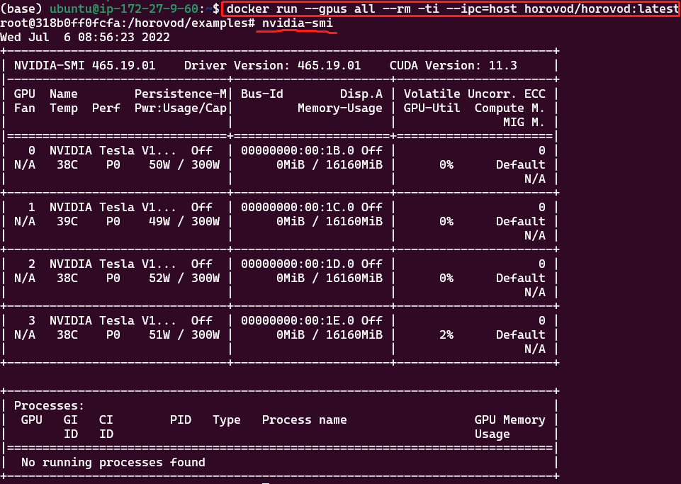
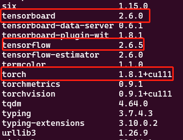
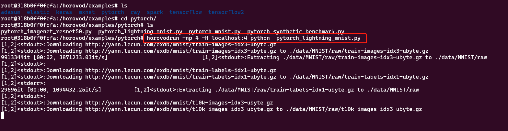

## 1 前提条件

- 本机已经安装完GPU驱动，CUDA、CUDNN和docker v19.03+（像使用`pytorch/pytorch:1.12.0-cuda11.3-cudnn8-runtime`镜像的前提条件一样）

### 1.1 MPI

[通信方式](./pytorch-通信方式.md)

MPI 可用作 Gloo 的替代方案，用于协调 Horovod 中的进程之间的工作。使用 NCCL 时，两者的性能相似，但如果您进行 CPU 训练，则使用 MPI 有明显的性能优势。

## 2 容器单机多卡运行 horovod case

- 拉取镜像，此镜像很大（6G+)

```shell
docker pull horovod/horovod:latest
```

- 进入容器，容器环境已经把很多依赖都装好了，比如 `nvidia-smi`、`torch`、`tensorflow`、`mpirun` 等
```shell
# --ipc=host 共享主机内存，单机多卡通信要用到
docker run --gpus all --rm -ti --ipc=host horovod/horovod:latest
```




- 执行`pip list`可以看到很多依赖包都装好了，这里要注意版本适配的问题，选择不同的 `horovod/horovod:latest` 镜像




### 2.1 运行一个case

- 容器中已经包含了很多case，选取其中一个，执行下面的命令运行：

```shell
# horovodrun 引入了一个方便的、基于 Open MPI 的包装器，用于运行 Horovod 脚本。

horovodrun -np 4 -H localhost:4 python  pytorch_mnist.py
```

上面的命令等价 (单机多卡间无法通信，miss rank 或者 Connection reset by peer 通过启动docker 时加上 --ipc=host 共享主机内存解决)

```shell
mpirun --allow-run-as-root -np 4 \
    -bind-to none -map-by slot \
    -x NCCL_DEBUG=INFO -x LD_LIBRARY_PATH -x PATH \
    -mca pml ob1 -mca btl ^openib \
    python pytorch_mnist.py
```



从上面的图可以看出，单机多卡分布式训练已经启动了，本机调用 `watch -n 10 nvidia-smi` 命令，可以查看GPU的使用情况。


