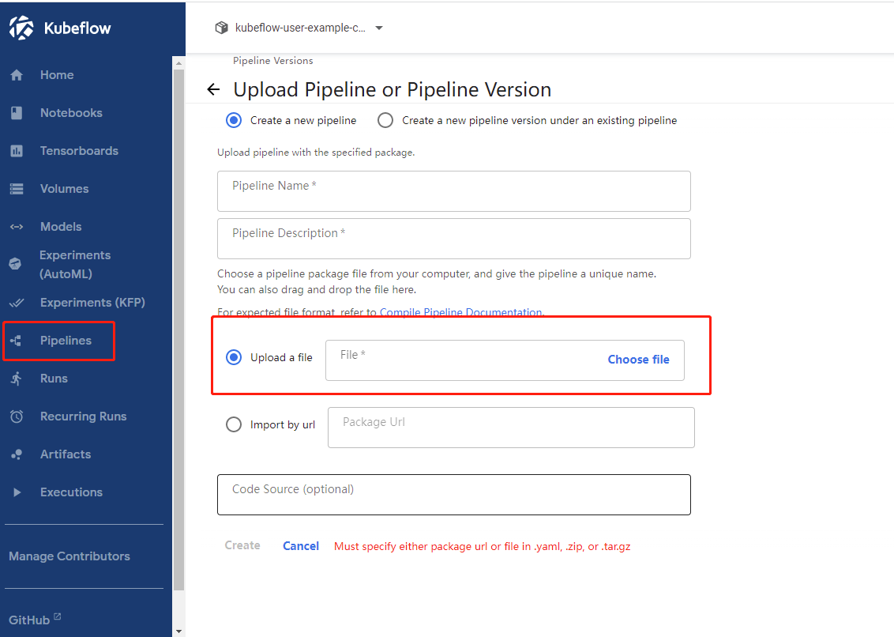

# 制作kubeflow pipeline 的 压缩包（构建自定义的 Workflow）

- [构建过程](https://cloud.tencent.com/developer/article/1674953)
- [简介参考](https://github.com/shikanon/kubeflow-manifests/blob/master/docs/introduction.md)

- [参考](https://github.com/kubeflow/pipelines/blob/master/samples/contrib/kubeflow-katib/mpi-job-horovod.py)

- 就是该目录下的 `mpi_horovod_pipeline.py` 文件，执行完之后会生成 `mpi_horovod_pipeline.py.tar.gz`，
压缩文件就是上传到pipeline上执行的脚步，上传后会自动解析成yaml文件，并可以web页面操作执行。如下图所示：

- `test_pipeline.py` --> `test_pipeline.py.zip` 也是同样的道理

# 通过 kubeflow 上的 notebook 提交 pipeline

[参考代码](https://github.com/kubeflow/pipelines/blob/master/samples/contrib/kubeflow-katib/early-stopping.ipynb)

- 就是该文件夹下的 `early-stopping.ipynb` 文件

