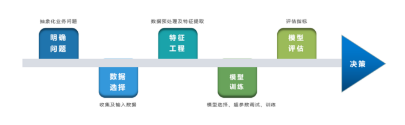
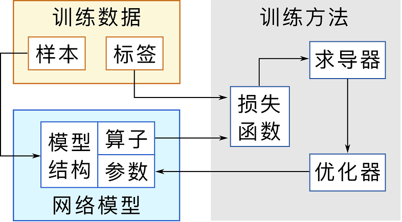
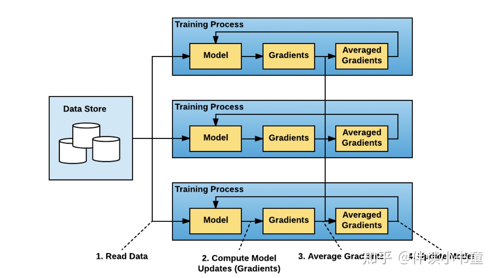
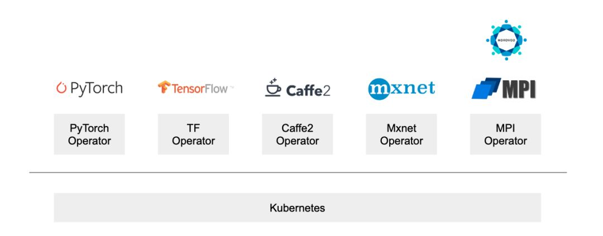

# 基于Horovod在k8s上实现分布式模型训练

- AI模型训练
- 分布式训练框架 `Horovod`
- `k8s`、`kubeflow`、`MPI-operator`

## 1- AI模型训练的过程

- 全流程



- 详细的训练过程，包括数据集、算法模型、损失函数和优化器四大模块，训练过程就是不断调优确定模型参数的过程。




### 1.1 训练数据

在机器学习问题中，数据就定义了问题本身。在有监督学习中，一般需要由 待测样本 和 监督标签 组成的成对训练数据。

### 1.2 “模型”或“网络”

定义了数据的变换形式，模型总体上分成以下三个要素:

- 算子: 数据变换的基本操作，是模型中的“动词”，比如加减乘除、卷积等等
- 参数: 参与数据变换运算的参数，例如卷积的权重等，它和样本特征一起组成了模型中的“名词”
- 结构: 定义模型中的动词和名词如何连接，也就是数据如何流动的


    如果把模型中的动词、名词作为节点，数据流动关系定义为边，这显然是一个图结构
    如果图是在运行前定义好的，运行时只需要把数据输入进图里，这种风格就称为静态图
    如果运行前没有完全定义图，运行时动态控制数据流动，这种风格就称为动态图


### 1.3 模型的训练方法

也就是如何调整模型中的参数，使得样本数据经过模型变换后能与监督标签尽量接近
- 常见的深度学习训练过程一般都能定义为一个优化问题，通过调整模型参数，最小化损失函数值
- 现阶段常用的优化方法仍然是反向传播和各类变种的梯度下降，这就要求模型算子是可导的
- 使用求导器完成反向传播过程中的梯度计算，使用优化器调整模型参数

## 2- 分布式训练

### 2.1 为什么需要分布式训练

- 模型规模迅速增加。2015年的 ResNet50 有2000万的参数， 2018年的 BERT-Large有3.45亿的参数，2018年的 GPT-2 有15亿的参数，
而2020年的 GPT-3 有1750亿个参数。很明显，模型规模随着时间的推移呈指数级增长。目前最大的模型已经超过了1000多亿个参数。
而与较小的模型相比，超大型模型通常能提供更优越的性能。

- 数据集规模迅速增加。对于大多数机器学习开发者来说，MNIST 和 CIFAR10 数据集往往是他们训练模型的前几个数据集。然而，
与著名的 ImageNet 数据集相比，这些数据集非常小。谷歌甚至有自己的（未公布的）JFT-300M 数据集，它有大约3亿张图片，
这比 ImageNet-1k 数据集大了近300倍。

- 计算能力越来越强。随着半导体行业的进步，显卡变得越来越强大。由于核的数量增多，GPU是深度学习最常见的算力资源。
从2012年的 K10 GPU 到2020年的 A100 GPU，计算能力已经增加了几百倍。这使我们能够更快地执行计算密集型任务，而深度学习正是这样一项任务。

如今，我们接触到的模型可能太大，以致于无法装入一个GPU，而数据集也可能大到足以在一个GPU上训练一百天。这时，只有用不同的并行化技术在多个GPU上训练我们的模型，我们才能完成并加快模型训练，以追求在合理的时间内获得想要的结果。


### 2.2 分布式训练的并行方式

在分布式训练过程中，并不是所有的训练任务都可以拆分，当前常用的拆分方式有如下几种：
- 数据并行：将数据集切分放到各计算节点，每个计算节点的计算内容完全一致，并在多个计算节点之间传递模型参数，通常称这种并行训练方法为数据并行。数据并行可以解决数据集过大无法在单机高效率训练的问题，也是工业生产中最常用的并行方法。
- 模型并行：通常指将模型单个算子计算分治到多个硬件设备上并发计算，以达到计算单个算子计算速度的目的。一般会将单个算子的计算，利用模型并行的方式分配在配置相同的几个硬件上，进行模型存储和计算，以保证计算步调一致。
- 流水线并行：一般是指将模型的不同算子，拆分到不同的硬件设备上进行计算，通过生产者-消费者的方式（流水线）完成不同设备之间的数据流通。深度学习中的跨设备交换数据场景很多，例如硬盘数据到内存，内存数据到显存，内存数据到网卡等，由于不同硬件之间处理数据的速度通常不一致，通常会采用流水线并行的方式进行训练效率最大化。

在工业场景的实践中，分布式模型训练也会采用不同并行方式的组合，例如数据并行与模型并行结合，数据并行与流水线并行结合等。其中数据并行的应用范围最广，
像搜索、推荐领域的深度学习模型，通常都是采用数据并行的方式进行切分的。

数据并行相对来说更简单一些，N台分布式Worker，每台只处理1/N的数据，理想情况下能达到近似线性的加速效果，大多数的机器学习框架都原生支持或者改动很小就可以支持数据并行模式。

模型并行相对复杂一点，对于TensorFlow这类基于计算图的框架而言，可以通过对计算图的分析，把原计算图拆成多个最小依赖子图分别放置到不同的Worker上，同时在多个子图之间插入通信算子（Send/Recieve）来实现模型并行。由于模型并行本身的复杂性，加之开发调试困难，同时对模型本身的结构也有一定要求，在工业应用中，大部分还是以数据并行为主。

#### 2.2.1 数据并行

该方法主要是将样本分割到不同的训练节点上，每个训练节点包含了整体的模型参数，整个架构属于多个节点的对样本进行分片，从而加快模型对样本的训练。
训练过程中各个节点间需要进行参数的同步和梯度的更新。具体更新方式如下所示：

1. 训练脚本通过调系统申请在多个节点上运行，每个节点上模型是一样的，统称为训练worker：

    a）每个worker分别读取各自的样本块，比如通过hash的方式get等；
    
    b）将样本作为模型的其输入数据进行训练，产生loss；
    
    c）根据产生的loss进行计算，生成梯度，计算模型更新（梯度）；

2. 计算这些副本梯度的均值；

3. 各个节点的worker通过`通信机制`，完成最新参数的获取；
4. 重复上述步骤



## 3 分布式训练框架-Horovod

Horovod是Uber开源的跨平台的分布式训练工具，名字来自于俄国传统民间舞蹈，舞者手牵手围成一个圈跳舞，与Horovod设备之间的通信模式很像，有以下几个特点：

- 兼容TensorFlow、Keras和PyTorch机器学习框架。
- 使用Ring-AllReduce算法，对比Parameter Server算法，有着无需等待，负载均衡的优点。
- 实现简单，五分钟包教包会。（划重点）

[horovod 官方案例](https://github.com/horovod/horovod/tree/master/examples)

Horovod依赖于Nvidia的 NCCL2 做 All Reduce，依赖于MPI(Message Passing Interface 一种用于并行计算的消息传递标准)做进程间通信，
简化了同步多 GPU 或多节点分布式训练的开发流程。 由于使用了NCCL2，Horovod也可以利用以下功能：NVLINK，RDMA，GPUDirectRDMA，
自动检测通信拓扑，能够回退到 PCIe 和 TCP/IP 通信。

- 引导分析：

Hovorod 怎么进行数据分割？

- 答案：有的框架可以自动做数据分割。如果框架不提供，则需要用户自己进行数据分割，以保证每个GPU进程训练的数据集是不一样的。

Hovorod 怎么进行训练代码分发？

- 用户需要手动拷贝训练代码到各个节点上。

Hovorod 启动时候，python 和 C++ 都做了什么？

- 答案：python 会引入 C++库，初始化各种变量和配置。C++部分会对 MPI，GLOO上下文进行初始化，启动后台进程处理内部通信。


如何确保 Hovorod 启动时候步骤一致；

- 答案： rank 0 上的所有参数只在 rank 0 初始化，然后广播给其他节点，即变量从第一个流程向其他流程传播，以实现参数一致性初始化。

### 3.1 案例和MPI启动

[案例](https://github.com/horovod/horovod/tree/master/examples)

[MPI启动](https://github.com/horovod/horovod/blob/master/docs/mpi.rst)

[kubeflow MPI](https://www.kubeflow.org/docs/components/training/mpi/)

[k8s mpi 启动 horovod 的yaml 配置](https://docs.amazonaws.cn/deep-learning-containers/latest/devguide/deep-learning-containers-eks-tutorials-distributed-gpu-training.html)


## 4 k8s 环境下安装 kubeflow

- 使用kubeflow 的 MPI-operator 和 pipeline 跑 horovod任务可以调sdk接口，可以可视化过程和日志输出。

[kubeflow 简介](https://zhuanlan.zhihu.com/p/98889237)

[安装教程](./README.md)


### 4.1 kubeflow operators



Operator是针对不同的机器学习框架提供资源调度和分布式训练的能力（TF-Operator，PyTorch-Operator，Caffe2-Operator，MPI-Operator，MXNet-Operator）,
主要的工作包括：

- 在 Kubernetes 集群上创建 Pod 以拉起各个训练进程
- 配置用作服务发现的信息（如 TF_CONFIG）以及创建相关 Kubernetes 资源（如 Service）
- 监控并更新整个任务的状态


#### 4.1.1 1 MPI Operator

MPI(Message Passing Interface) 是一种可以支持点对点和广播的通信协议，具体实现的库有很多，使用比较流行的包括 Open Mpi, Intel MPI 等等。

MPI Operator 是 Kubeflow 的一个组件，是 Kubeflow 社区贡献的另一个关于深度/机器学习的一个 Operator，主要就是为了 MPI 任务或者 Horovod 任务提供了一个多机管理工作。

- Kubeflow 提供 mpi-operator，可使 allreduce 样式的分布式训练像在单个节点上进行培训一样简单。

- 我们可以轻松地在 Kubernetes 上运行 allreduce 样式的分布式训练。在操作系统上安装ksonnet 后，可安装 MPI Operator。其后将安装 MPIJob 和作业控制器，最后可以将 MPIJob 提交到 Kubernetes 集群。

- 对于用户，只要创建一个 MPIJob 的自定义资源对象，在 Template 配置好 Launcher 和 Worker 的相关信息，就相当于描述好一个分布式训练程序的执行过程了。

- Mpi-operator 可以做到开箱即用，但是在生产集群的应用，面对一些固定场景和业务的时候会有一定的限制。

mpi-operator 是 Kubeflow 社区贡献的另一个关于深度/机器学习的一个 Operator，关于 mpi-operator 的 proposal，
可以参考 mpi-operator-proposal。目前社区在 mpi-operator 主要用于 allreduce-style 的分布式训练，因为 mpi-operator 
本质上就是给用户管理好多个进程之间的关系，所以天然支持的框架很多，包括 Horovod, TensorFlow, PyTorch, Apache MXNet 等等。
而 mpi-operator 的基本架构是通过 Mpijob 的这种自定义资源对象来描述分布式机器学习的训练任务，同时实现了 Mpijob 的 Controller 来控制，
其中分为 Launcher 和 Worker 这两种类型的工作负荷。

- 对于用户，只要创建一个 Mpijob 的自定义资源对象，在 Template 配置好 Launcher 和 Worker 的相关信息，就相当于描述好一个分布式训练程序的执行过程了。

```yaml
apiVersion: kubeflow.org/v1alpha2
kind: MPIJob
metadata:
  name: tensorflow-mnist
spec:
  slotsPerWorker: 1
  cleanPodPolicy: Running
  mpiReplicaSpecs:
    Launcher:
      replicas: 1
      template:
        spec:
          containers:
          - image: horovod-cpu:latest
            name: mpi-launcher
            command:
            - mpirun
            args:
            - -np
            - "2"
            - --allow-run-as-root
            - -bind-to
            - none
            - -map-by
            - slot
            - -x
            - LD_LIBRARY_PATH
            - -x
            - PATH
            - -mca
            - pml
            - ob1
            - -mca
            - btl
            - ^openib
            - python
            - /examples/tensorflow_mnist.py
            resources:
              limits:
                cpu: 1
                memory: 2Gi
    Worker:
      replicas: 2
      template:
        spec:
          containers:
          - command:
            - ""
            image: horovod-cpu:latest
            name: mpi-worker
            resources:
              limits:
                cpu: 2
                memory: 4Gi
```

- Worker 本质上是 StatefulSet，在分布式训练的过程中，训练任务通常是有状态的，StatefulSet 正是管理这些的 Workload 的对象。

- Launcher 相当于一个启动器的角色，它会等Worker都就位之后，去启动MPI的任务。通常会是一个比较轻量化的 Job，他主要完成几条命令的发送就可以了，
通常是把命令通过 ssh/rsh 来发送接受命令，在 mpi-operator 里使用的是 kubectl 来给 Worker 发送命令。 

下图是其基础架构图。


[kubeflow-mpijob horovod 案例](https://github.com/kubeflow/mpi-operator/tree/master/examples/v2beta1/horovod)

[详细介绍](https://mp.weixin.qq.com/s/83_5FKrGFy1oupMIkulJhg)

## 5 kubeflow web演示

